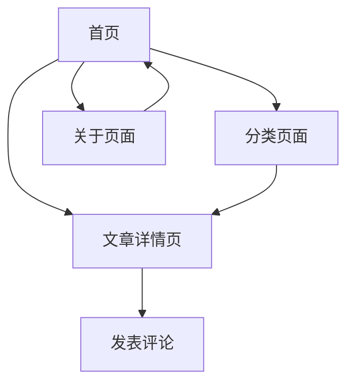

## 1. Product Overview
爱米的前端小笔记是一个专注于前端技术分享的个人博客平台。旨在为前端开发者提供技术文章阅读、学习交流的空间。
- 解决前端开发者技术学习和经验分享的需求
- 目标用户为前端开发者、技术爱好者
- 提供简洁优雅的技术文章阅读体验

## 2. Core Features

### 2.1 User Roles
| Role | Registration Method | Core Permissions |
|------|---------------------|------------------|
| 访客 | 无需注册 | 浏览文章、搜索文章 |
| 管理员 | 后台配置 | 发布文章、编辑文章、删除文章、管理评论 |

### 2.2 Feature Module
爱米的前端小笔记包含以下核心页面：
1. **首页**: 文章列表、分类导航、搜索功能
2. **文章详情页**: 文章内容展示、评论功能、相关文章推荐
3. **分类页面**: 按技术分类浏览文章
4. **关于页面**: 个人介绍、技能展示、联系方式

### 2.3 Page Details
| Page Name | Module Name | Feature description |
|-----------|-------------|---------------------|
| 首页 | 文章列表 | 展示最新文章列表，包含标题、摘要、发布时间、分类标签 |
| 首页 | 分类导航 | 显示技术分类（如React、Vue、JavaScript、CSS等） |
| 首页 | 搜索功能 | 支持按关键词搜索文章标题和内容 |
| 文章详情页 | 文章内容 | 展示文章标题、正文内容、发布时间、作者信息 |
| 文章详情页 | 评论功能 | 允许访客发表评论，显示评论列表 |
| 文章详情页 | 相关推荐 | 根据文章标签推荐相关技术文章 |
| 分类页面 | 分类筛选 | 按技术分类筛选展示文章列表 |
| 关于页面 | 个人介绍 | 展示博主个人信息和技术背景 |
| 关于页面 | 技能展示 | 展示技术栈和技能水平 |
| 关于页面 | 联系方式 | 提供邮箱、GitHub等联系方式 |

## 3. Core Process
### 访客流程
访客访问首页 → 浏览文章列表 → 点击感兴趣的文章 → 阅读文章详情 → 发表评论（可选）→ 返回继续浏览

### 管理员流程
管理员登录 → 进入文章管理 → 发布新文章/编辑现有文章 → 管理评论 → 查看访问统计

## 4. User Interface Design

### 4.1 Design Style
- **主色调**: 深蓝色 (#1e3a8a) 和白色 (#ffffff)
- **辅助色**: 浅灰色 (#f8fafc) 和深灰色 (#64748b)
- **按钮样式**: 圆角矩形，hover效果
- **字体**: 中文使用思源黑体，英文使用Inter
- **布局风格**: 卡片式布局，响应式网格系统
- **图标风格**: 使用简洁的线性图标

### 4.2 Page Design Overview
| Page Name | Module Name | UI Elements |
|-----------|-------------|-------------|
| 首页 | 文章列表 | 采用卡片式布局，每张卡片包含文章标题、摘要、标签，卡片hover时有轻微上浮效果 |
| 首页 | 分类导航 | 顶部导航栏，分类标签采用pill样式，选中状态使用主色调背景 |
| 文章详情页 | 文章内容 | 正文使用16px字体，1.6倍行高，代码块使用深色主题语法高亮 |
| 文章详情页 | 评论区 | 简洁的评论表单，评论列表显示头像、昵称、时间和内容 |
| 关于页面 | 个人介绍 | 居中布局，包含个人头像、简介文字，技能展示使用进度条 |

### 4.3 Responsiveness
采用桌面端优先设计，适配移动端显示。在移动设备上采用汉堡菜单，文章列表改为单列布局，确保在小屏幕上保持良好的阅读体验。