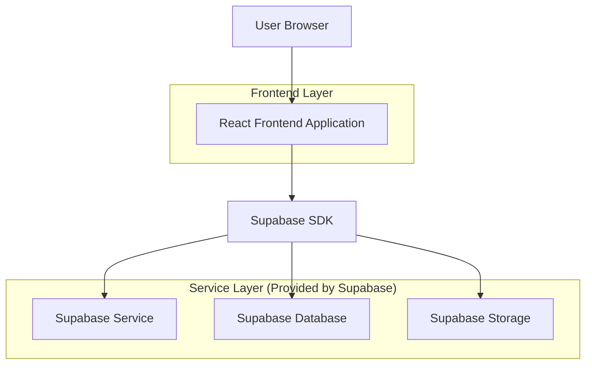
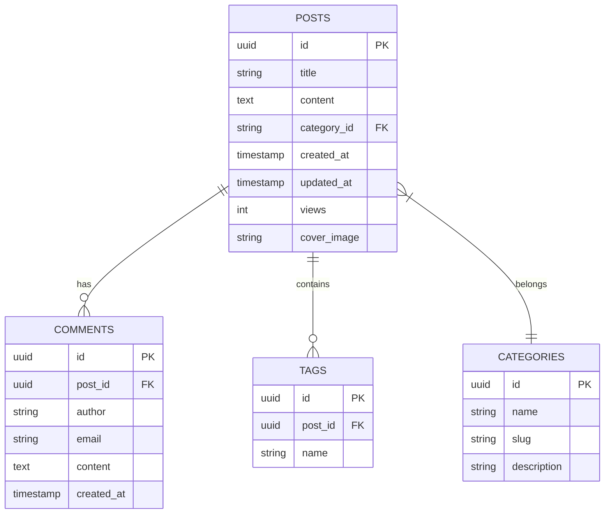

## 1. Architecture design



## 2. Technology Description
- Frontend: React@18 + tailwindcss@3 + vite
- Backend: Supabase (BaaS)
- Database: Supabase PostgreSQL
- Storage: Supabase Object Storage

## 3. Route definitions
| Route | Purpose |
|-------|---------|
| / | 首页，展示文章列表和分类导航 |
| /post/:id | 文章详情页，展示文章内容和评论 |
| /category/:category | 分类页面，按技术分类筛选文章 |
| /about | 关于页面，展示博主个人信息 |
| /search | 搜索结果页，显示搜索到的文章 |

## 4. API definitions

### 4.1 Core API

文章列表获取
```
GET /api/posts
```

Request:
| Param Name| Param Type  | isRequired  | Description |
|-----------|-------------|-------------|-------------|
| page      | number      | false       | 页码，默认1 |
| limit     | number      | false       | 每页数量，默认10 |
| category  | string      | false       | 分类筛选 |

Response:
| Param Name| Param Type  | Description |
|-----------|-------------|-------------|
| posts     | array       | 文章列表数据 |
| total     | number      | 文章总数 |

文章详情获取
```
GET /api/posts/:id
```

Response:
| Param Name| Param Type  | Description |
|-----------|-------------|-------------|
| id        | string      | 文章ID |
| title     | string      | 文章标题 |
| content   | string      | 文章内容 |
| category  | string      | 文章分类 |
| tags      | array       | 文章标签 |
| created_at| timestamp   | 创建时间 |
| views     | number      | 阅读次数 |

评论功能
```
POST /api/comments
```

Request:
| Param Name| Param Type  | isRequired  | Description |
|-----------|-------------|-------------|-------------|
| post_id   | string      | true        | 文章ID |
| author    | string      | true        | 评论者昵称 |
| content   | string      | true        | 评论内容 |
| email     | string      | false       | 评论者邮箱 |

## 5. Server architecture diagram
由于使用Supabase BaaS服务，无需自建后端服务器架构。所有数据操作通过Supabase客户端SDK直接在前端调用。

## 6. Data model

### 6.1 Data model definition


### 6.2 Data Definition Language
文章表 (posts)
```sql
-- create table
CREATE TABLE posts (
    id UUID PRIMARY KEY DEFAULT gen_random_uuid(),
    title VARCHAR(255) NOT NULL,
    content TEXT NOT NULL,
    category_id UUID REFERENCES categories(id),
    cover_image VARCHAR(500),
    views INTEGER DEFAULT 0,
    created_at TIMESTAMP WITH TIME ZONE DEFAULT NOW(),
    updated_at TIMESTAMP WITH TIME ZONE DEFAULT NOW()
);

-- create index
CREATE INDEX idx_posts_category ON posts(category_id);
CREATE INDEX idx_posts_created_at ON posts(created_at DESC);
```

分类表 (categories)
```sql
-- create table
CREATE TABLE categories (
    id UUID PRIMARY KEY DEFAULT gen_random_uuid(),
    name VARCHAR(100) NOT NULL,
    slug VARCHAR(100) UNIQUE NOT NULL,
    description TEXT,
    created_at TIMESTAMP WITH TIME ZONE DEFAULT NOW()
);

-- init data
INSERT INTO categories (name, slug, description) VALUES
('React', 'react', 'React相关技术文章'),
('Vue', 'vue', 'Vue相关技术文章'),
('JavaScript', 'javascript', 'JavaScript基础知识'),
('CSS', 'css', 'CSS样式和布局'),
('前端工程化', 'engineering', '前端工程化实践');
```

评论表 (comments)
```sql
-- create table
CREATE TABLE comments (
    id UUID PRIMARY KEY DEFAULT gen_random_uuid(),
    post_id UUID REFERENCES posts(id) ON DELETE CASCADE,
    author VARCHAR(100) NOT NULL,
    email VARCHAR(255),
    content TEXT NOT NULL,
    created_at TIMESTAMP WITH TIME ZONE DEFAULT NOW()
);

-- create index
CREATE INDEX idx_comments_post_id ON comments(post_id);
CREATE INDEX idx_comments_created_at ON comments(created_at DESC);
```

标签表 (tags)
```sql
-- create table
CREATE TABLE tags (
    id UUID PRIMARY KEY DEFAULT gen_random_uuid(),
    post_id UUID REFERENCES posts(id) ON DELETE CASCADE,
    name VARCHAR(50) NOT NULL
);

-- create index
CREATE INDEX idx_tags_post_id ON tags(post_id);
CREATE INDEX idx_tags_name ON tags(name);
```

-- 权限设置
GRANT SELECT ON posts TO anon;
GRANT SELECT ON categories TO anon;
GRANT SELECT ON comments TO anon;
GRANT SELECT ON tags TO anon;
GRANT ALL PRIVILEGES ON posts TO authenticated;
GRANT ALL PRIVILEGES ON categories TO authenticated;
GRANT ALL PRIVILEGES ON comments TO authenticated;
GRANT ALL PRIVILEGES ON tags TO authenticated;