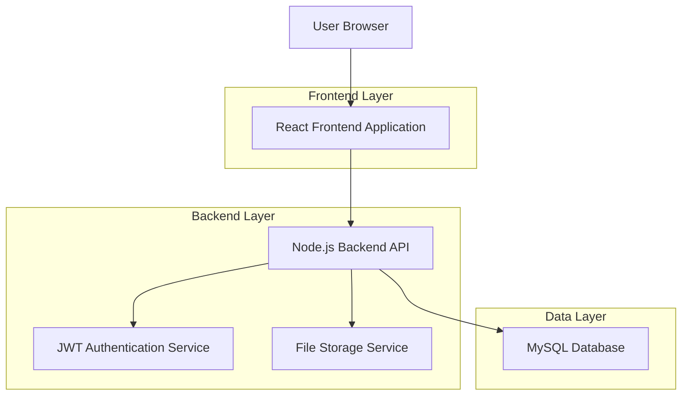
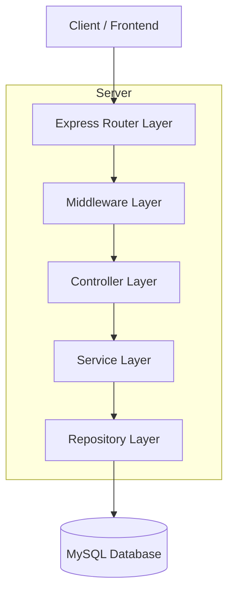
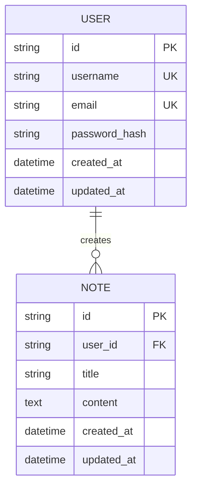

## 1.架构设计



## 2.技术描述

* Frontend: React\@18 + tailwindcss\@3 + vite

* Backend: Node.js\@18 + Express\@4 + TypeScript

* Database: MySQL\@8.0

* Authentication: JWT (jsonwebtoken)

* File Storage: Local file system / MinIO

* ORM: Sequelize\@6

## 3.路由定义

| Route      | Purpose                                                       |
| ---------- | ------------------------------------------------------------- |
| /          | Home page, displays the main content and navigation           |
| /login     | Login page, allows users to authenticate                      |
| /register  | Registration page, allows new users to create accounts        |
| /profile   | User profile page, displays user information and settings     |
| /dashboard | Dashboard page, provides an overview of user data and actions |

## 4.API定义

### 4.1 用户认证API

用户注册

```
POST /api/auth/register
```

请求:

| Param Name | Param Type | isRequired | Description |
| ---------- | ---------- | ---------- | ----------- |
| username   | string     | true       | 用户名         |
| email      | string     | true       | 邮箱地址        |
| password   | string     | true       | 密码          |

响应:

| Param Name | Param Type | Description |
| ---------- | ---------- | ----------- |
| success    | boolean    | 注册状态        |
| message    | string     | 响应消息        |
| token      | string     | JWT令牌       |

用户登录

```
POST /api/auth/login
```

请求:

| Param Name | Param Type | isRequired | Description |
| ---------- | ---------- | ---------- | ----------- |
| email      | string     | true       | 邮箱地址        |
| password   | string     | true       | 密码          |

响应:

| Param Name | Param Type | Description |
| ---------- | ---------- | ----------- |
| success    | boolean    | 登录状态        |
| message    | string     | 响应消息        |
| token      | string     | JWT令牌       |
| user       | object     | 用户信息        |

### 4.2 用户资料API

获取用户信息

```
GET /api/users/profile
```

请求头:

```
Authorization: Bearer <token>
```

响应:

| Param Name | Param Type | Description |
| ---------- | ---------- | ----------- |
| id         | string     | 用户ID        |
| username   | string     | 用户名         |
| email      | string     | 邮箱地址        |
| createdAt  | datetime   | 创建时间        |

更新用户信息

```
PUT /api/users/profile
```

请求头:

```
Authorization: Bearer <token>
```

请求:

| Param Name | Param Type | isRequired | Description |
| ---------- | ---------- | ---------- | ----------- |
| username   | string     | false      | 用户名         |
| email      | string     | false      | 邮箱地址        |

## 5.服务器架构图



## 6.数据模型

### 6.1 数据模型定义



### 6.2 数据定义语言

用户表 (users)

```sql
-- 创建用户表
CREATE TABLE users (
    id VARCHAR(36) PRIMARY KEY DEFAULT (UUID()),
    username VARCHAR(50) UNIQUE NOT NULL,
    email VARCHAR(100) UNIQUE NOT NULL,
    password_hash VARCHAR(255) NOT NULL,
    created_at TIMESTAMP DEFAULT CURRENT_TIMESTAMP,
    updated_at TIMESTAMP DEFAULT CURRENT_TIMESTAMP ON UPDATE CURRENT_TIMESTAMP
);

-- 创建索引
CREATE INDEX idx_users_email ON users(email);
CREATE INDEX idx_users_username ON users(username);
```

笔记表 (notes)

```sql
-- 创建笔记表
CREATE TABLE notes (
    id VARCHAR(36) PRIMARY KEY DEFAULT (UUID()),
    user_id VARCHAR(36) NOT NULL,
    title VARCHAR(200) NOT NULL,
    content TEXT,
    created_at TIMESTAMP DEFAULT CURRENT_TIMESTAMP,
    updated_at TIMESTAMP DEFAULT CURRENT_TIMESTAMP ON UPDATE CURRENT_TIMESTAMP,
    FOREIGN KEY (user_id) REFERENCES users(id) ON DELETE CASCADE
);

-- 创建索引
CREATE INDEX idx_notes_user_id ON notes(user_id);
CREATE INDEX idx_notes_created_at ON notes(created_at DESC);
```

